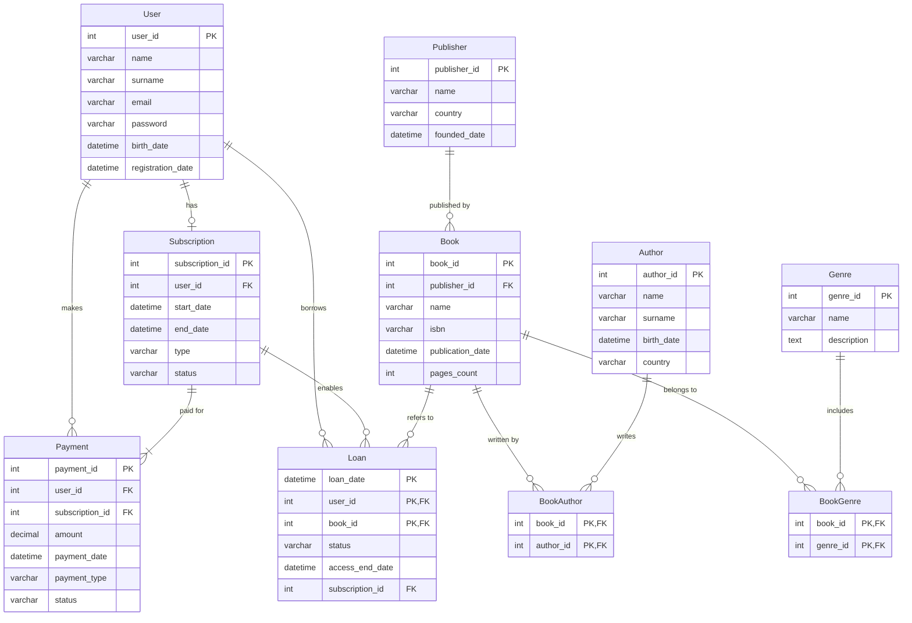

# Лабораторна робота №1: Збір вимог та розробка ER-схеми

## Проектування бази даних для онлайн-бібліотеки

Цей проект є виконанням лабораторної роботи №1, метою якої є аналіз вимог предметної області, виділення ключових сутностей та атрибутів, а також створення концептуальної ER-діаграми (Entity-Relationship Diagram) для майбутньої бази даних.

### Зміст
1. [Опис проекту](#опис-проекту)
2. [ER-діаграма схеми](#er-діаграма-схеми)
3. [Опис сутностей та зв'язків](#опис-сутностей-та-звязків)
4. [Припущення та обмеження](#припущення-та-обмеження)

### Опис проекту
Система, що проектується, є платформою онлайн-бібліотеки, яка надає користувачам доступ до каталогу книг за моделлю підписки. Користувачі можуть реєструватися, оформлювати підписку, оплачувати її та отримувати доступ до книг на певний період (оренда). Система повинна зберігати інформацію про користувачів, книги, авторів, видавців, а також відстежувати всі операції, пов'язані з підписками та орендою книг.

#### Функціональні вимоги:
* Користувач повинен мати можливість створити обліковий запис.
* Користувач повинен мати можливість оформити та оплатити підписку.
* Система повинна дозволяти користувачеві "брати в оренду" книги з каталогу за наявності активної підписки.
* Система повинна відстежувати початок та кінець терміну оренди книги.

#### Вимоги до даних:
* Зберігати інформацію про користувачів (ім'я, email, пароль, дата народження).
* Зберігати дані про книги (назва, ISBN, дата публікації, кількість сторінок).
* Зберігати інформацію про авторів, жанри та видавців.
* Відстежувати підписки користувачів (тип, дати початку та кінця, статус).
* Зберігати історію платежів, пов'язаних із підписками.
* Зберігати історію оренди книг користувачами.

### ER-діаграма схеми

Код діаграми у форматі Mermaid

### Опис сутностей та зв'язків

#### Сутності та атрибути

* **User** - Зберігає дані про зареєстрованих користувачів.
    * `user_id` (PK): Унікальний ідентифікатор користувача.
    * `name`: Ім'я.
    * `surname`: Прізвище.
    * `email`: Електронна пошта (унікальна).
    * `password`: Пароль (передбачається зберігання хешу).
    * `birth_date`: Дата народження.
    * `registration_date`: Дата і час реєстрації.

* **Subscription** - Інформація про підписки користувачів.
    * `subscription_id` (PK): Унікальний ідентифікатор підписки.
    * `start_date`: Дата початку дії підписки.
    * `end_date`: Дата закінчення дії підписки.
    * `type`: Тип підписки (напр., "місячна", "річна").
    * `status`: Статус (напр., "активна", "закінчилась").
    * `user_id` (FK): Посилання на користувача, якому належить підписка.

* **Payment** - Історія платежів за підписки.
    * `payment_id` (PK): Унікальний ідентифікатор платежу.
    * `amount`: Сума платежу.
    * `payment_date`: Дата і час платежу.
    * `payment_type`: Тип оплати (напр., "картка", "Google Pay").
    * `status`: Статус платежу (напр., "успішний", "помилка").
    * `user_id` (FK): Посилання на користувача, що здійснив платіж.
    * `subscription_id` (FK): Посилання на підписку, за яку було сплачено.

* **Loan** - Записи про оренду книг користувачами.
    * `loan_date` (PK): Дата і час взяття книги в оренду.
    * `user_id` (PK, FK): Ідентифікатор користувача, що взяв книгу.
    * `book_id` (PK, FK): Ідентифікатор орендованої книги.
    * `status`: Статус оренди (напр., "активна", "повернена").
    * `access_end_date`: Дата і час, до якої книга доступна.
    * `subscription_id` (FK): Посилання на підписку, в рамках якої взято книгу.

* **Book** - Основна інформація про книги в каталозі.
    * `book_id` (PK): Унікальний ідентифікатор книги.
    * `name`: Назва книги.
    * `isbn`: Міжнародний стандартний книжковий номер.
    * `publication_date`: Дата публікації.
    * `pages_count`: Кількість сторінок.
    * `publisher_id` (FK): Посилання на видавця книги.

* **Publisher, Author, Genre** - Довідкові таблиці з інформацією про видавців, авторів та жанри відповідно.
    * Містять `id` (PK), `name` та інші описові атрибути.

* **BookAuthor, BookGenre** - Асоціативні таблиці для реалізації зв'язків "багато-до-багатьох".
    * `BookAuthor` (`book_id` (PK, FK), `author_id` (PK, FK)): Пов'язує книги з авторами.
    * `BookGenre` (`book_id` (PK, FK), `genre_id` (PK, FK)): Пов'язує книги з жанрами.

#### Пояснення зв'язків прозою
* **User --- Subscription (1 : 0..1):** Один `Користувач` може мати **нуль або одну** `Підписку`. Кожна `Підписка` **обов'язково** належить одному `Користувачу`.
* **User --- Loan (1 : 0..N):** Один `Користувач` може мати **нуль або більше** `Оренд`. Кожна `Оренда` **обов'язково** належить одному `Користувачу`.
* **User --- Payment (1 : 0..N):** Один `Користувач` може зробити **нуль або більше** `Платежів`. Кожен `Платіж` **обов'язково** належить одному `Користувачу`.
* **Subscription --- Payment (1 : 1..N):** Одна `Підписка` повинна мати **один або більше** `Платежів`. Кожен `Платіж` **обов'язково** належить одній `Підписці`.
* **Subscription --- Loan (1 : 0..N):** В рамках однієї `Підписки` може бути **нуль або більше** `Оренд`. Кожна `Оренда` **обов'язково** пов'язана з однією `Підпискою`.
* **Book --- Loan (1 : 0..N):** Одна `Книга` може бути в **нуль або більше** `Орендах`. Кожна `Оренда` **обов'язково** стосується однієї `Книги`.
* **Book --- Publisher (N : 1):** Багато `Книг` можуть бути випущені одним `Видавцем`. Кожна `Книга` **обов'язково** має одного `Видавця`.
* **Book ↔ Author (M:N):** Зв'язок "багато-до-багатьох", реалізований через таблицю `BookAuthor`. Одна книга може мати кількох авторів, і один автор може написати багато книг.
* **Book ↔ Genre (M:N):** Зв'язок "багато-до-багатьох", реалізований через таблицю `BookGenre`. Одна книга може належати до кількох жанрів, і в одному жанрі може бути багато книг.

### Припущення та обмеження
1.  **Історія підписок:** Зв'язок `User` до `Subscription` як "один до нуля-або-одного" припускає, що система не зберігає повну історію всіх минулих підписок користувача. Моделюється лише поточна або остання підписка.
2.  **Тип книг:** Схема не розрізняє фізичні та електронні книги. Відсутність сутності "Екземпляр книги" (`BookCopy`) дозволяє припустити, що йдеться про електронну бібліотеку, де кількість одночасних оренд однієї книги не обмежена.
3.  **Безпека:** Атрибут `password` у таблиці `User` показано умовно. Припускається, що в реальній системі він буде зберігатися у вигляді безпечного хешу, а не відкритого тексту.
4.  **Фінансові транзакції:** Модель спрощено відображає факт оплати (`Payment`), але не включає деталі платіжних шлюзів, обробки повернень чи складних фінансових звітів.