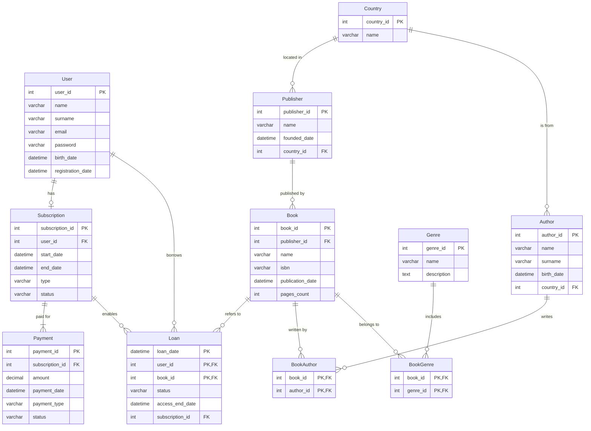

# Звіт до Лабораторної роботи №5

## Нормалізація бази даних

---

## Мета

Проаналізувати та вдосконалити початкову схему бази даних, привівши її до **Третьої нормальної форми (3NF)**, для усунення надмірності та аномалій оновлення.

---

## 1. Аналіз початкової схеми та функціональні залежності (ФЗ)

**Функціональна залежність** ($X \to Y$) — це твердження, що набір атрибутів $X$ (детермінант) однозначно визначає набір атрибутів $Y$.

### 1.1. Перевірка нормальних форм (1NF, 2NF)

Початкова схема вже відповідає 1NF та 2NF:

* **1NF (Перша нормальна форма):** дотримано. Усі атрибути є атомарними, відсутні повторювані групи або списки в одному стовпці.
* **2NF (Друга нормальна форма):** дотримано. Для таблиць зі складеними первинними ключами *(Loan, BookAuthor, BookGenre)* не виявлено часткових залежностей.

**Найвища початкова форма:** 2NF.

---

### 1.2. Функціональні залежності та порушення 3NF

Порушення 3NF виникає через транзитивні залежності — коли неключовий атрибут залежить від іншого неключового атрибута.

| Таблиця      | Первинний ключ (ПК)               | Функціональні залежності                           | Порушення 3NF                                                             |
| ------------ | --------------------------------- | -------------------------------------------------- | ------------------------------------------------------------------------- |
| User         | **user_id**                       | user_id → name, ..., registration_date             | Немає                                                                     |
| Publisher    | **publisher_id**                  | publisher_id → name, country, founded_date         | Повторення country є надмірністю                                          |
| Author       | **author_id**                     | author_id → name, ..., country                     | Повторення country є надмірністю                                          |
| Subscription | **subscription_id**               | subscription_id → user_id, start_date, ..., status | Немає                                                                     |
| Payment      | **payment_id**                    | payment_id → subscription_id → user_id             | user_id залежить від неключового subscription_id (транзитивна залежність) |
| Loan         | **(loan_date, user_id, book_id)** | → status, access_end_date, subscription_id         | Немає                                                                     |

---

## 2. Покрокова нормалізація (перехід до 3NF)

### Крок 1: Усунення транзитивної залежності `country`

**Проблема:** назви країн у таблицях *Publisher* та *Author* дублюються.

**Рішення:** створено довідкову таблицю `Country`, а текстове поле `country` замінено на зовнішній ключ `country_id`.

#### Оригінальний дизайн

| Таблиця   | Атрибути                                                    |
| --------- | ----------------------------------------------------------- |
| Publisher | **publisher_id**, name, country (VARCHAR), founded_date     |
| Author    | **author_id**, name, surname, birth_date, country (VARCHAR) |

#### Перероблений дизайн (3NF)

| Таблиця   | Атрибути та ключі                                              | Пояснення                          |
| --------- | -------------------------------------------------------------- | ---------------------------------- |
| Country   | **country_id** (PK), name (UNIQUE)                             | Назва країни зберігається один раз |
| Publisher | **publisher_id** (PK), name, founded_date, country_id (FK)     | Залежить тільки від ПК             |
| Author    | **author_id** (PK), name, surname, birth_date, country_id (FK) | Залежить тільки від ПК             |

---

### Крок 2: Усунення транзитивної залежності `user_id` у Payment

**Проблема:** user_id залежить від subscription_id, а не від payment_id. Це створює надмірність.

**Рішення:** видалено поле `user_id` з таблиці Payment.

#### Оригінальний дизайн

| Таблиця | Атрибути                                                |
| ------- | ------------------------------------------------------- |
| Payment | **payment_id**, user_id (FK), subscription_id (FK), ... |

#### Перероблений дизайн (3NF)

| Таблиця | Атрибути та ключі                                      | Пояснення                       |
| ------- | ------------------------------------------------------ | ------------------------------- |
| Payment | **payment_id** (PK), subscription_id (FK), amount, ... | Усі поля залежать тільки від PK |

---

## 3. Фінальні результати

### 3.1. Оновлена ER-діаграма

<summary>Код діаграми у форматі Mermaid</summary>



Оновлена діаграма відображає:

* нову таблицю `Country`,
* зв'язки між `Publisher` – `Country` та `Author` – `Country`,
* оновлену структуру таблиці `Payment`.

---

### 3.2. Перероблений дизайн таблиць (SQL)

```sql
-- Створення нової довідкової таблиці
CREATE TABLE IF NOT EXISTS Country (
    country_id SERIAL PRIMARY KEY,
    name VARCHAR(100) UNIQUE NOT NULL
);

-- Нормалізація Publisher
ALTER TABLE Publisher ADD COLUMN country_id INT;
ALTER TABLE Publisher DROP COLUMN country;
ALTER TABLE Publisher
    ADD CONSTRAINT fk_publisher_country
    FOREIGN KEY (country_id) REFERENCES Country(country_id) ON DELETE SET NULL;

-- Нормалізація Author
ALTER TABLE Author ADD COLUMN country_id INT;
ALTER TABLE Author DROP COLUMN country;
ALTER TABLE Author
    ADD CONSTRAINT fk_author_country
    FOREIGN KEY (country_id) REFERENCES Country(country_id) ON DELETE SET NULL;

-- Нормалізація Payment
ALTER TABLE Payment DROP COLUMN user_id;
```

---

### 3.3. SQL DDL-скрипти

Файл **schema_new.sql** містить повні інструкції `CREATE TABLE` для всієї оновленої схеми у 3NF, включаючи:

* таблицю `Country`,
* виправлені зовнішні ключі,
* оптимізовану структуру таблиці `Payment`.

```sql
CREATE TYPE subscription_status AS ENUM (
	'ACTIVE',
	'EXPIRED',
	'CANCELLED'
);

CREATE TYPE subscription_type AS ENUM (
	'TRIAL',
	'STANDARD',
	'PREMIUM'
);

CREATE TYPE payment_status AS ENUM (
	'COMPLETED',
	'PENDING',
	'FAILED'
);

CREATE TYPE payment_type AS ENUM (
	'CARD',
	'PAYPAL',
	'CRYPTO'
);

CREATE TYPE loan_status AS ENUM (
	'ACTIVE',
	'RETURNED',
	'EXPIRED'
);

CREATE TABLE IF NOT EXISTS "User" (
    user_id SERIAL PRIMARY KEY,
    name VARCHAR(100) NOT NULL,
    surname VARCHAR(100) NOT NULL,
    email VARCHAR(150) UNIQUE NOT NULL,
    password_hash VARCHAR(255) NOT NULL,
    birth_date DATE,
    registration_date TIMESTAMP DEFAULT CURRENT_TIMESTAMP
);

CREATE TABLE IF NOT EXISTS Subscription (
    subscription_id SERIAL PRIMARY KEY,
    user_id INT NOT NULL REFERENCES "User"(user_id) ON DELETE CASCADE,
    start_date DATE NOT NULL,
    end_date DATE NOT NULL,
    type subscription_type NOT NULL,
    status subscription_status NOT NULL
);

-- Нова таблиця Country
CREATE TABLE IF NOT EXISTS Country (
    country_id SERIAL PRIMARY KEY,
    name VARCHAR(100) UNIQUE NOT NULL
);

-- Оновлено Publisher
CREATE TABLE IF NOT EXISTS Publisher (
    publisher_id SERIAL PRIMARY KEY,
    name VARCHAR(150) NOT NULL,
    country VARCHAR(100),
    founded_date DATE,
    country_id INT REFERENCES Country(country_id) ON DELETE SET NULL
);

CREATE TABLE IF NOT EXISTS Book (
    book_id SERIAL PRIMARY KEY,
    publisher_id INT REFERENCES Publisher(publisher_id) ON DELETE SET NULL,
    name VARCHAR(200) NOT NULL,
    isbn VARCHAR(20) UNIQUE NOT NULL,
    publication_date DATE,
    pages_count INT CHECK (pages_count > 0)
);

-- Оновлено Author
CREATE TABLE IF NOT EXISTS Author (
    author_id SERIAL PRIMARY KEY,
    name VARCHAR(100) NOT NULL,
    surname VARCHAR(100) NOT NULL,
    birth_date DATE,
    country_id INT REFERENCES Country(country_id) ON DELETE SET NULL
);

CREATE TABLE IF NOT EXISTS Genre (
    genre_id SERIAL PRIMARY KEY,
    name VARCHAR(100) UNIQUE NOT NULL,
    description TEXT
);

-- Оновлено Payment
CREATE TABLE IF NOT EXISTS Payment (
    payment_id SERIAL PRIMARY KEY,
    subscription_id INT NOT NULL REFERENCES Subscription(subscription_id) ON DELETE CASCADE,
    amount NUMERIC(8,2) CHECK (amount > 0),
    payment_date TIMESTAMP DEFAULT CURRENT_TIMESTAMP,
    payment_type payment_type NOT NULL,
    status payment_status NOT NULL
);

CREATE TABLE IF NOT EXISTS Loan (
    loan_date TIMESTAMP DEFAULT CURRENT_TIMESTAMP,
    user_id INT NOT NULL REFERENCES "User"(user_id) ON DELETE CASCADE,
    book_id INT NOT NULL REFERENCES Book(book_id) ON DELETE CASCADE,
    status loan_status NOT NULL,
    access_end_date DATE,
    subscription_id INT REFERENCES Subscription(subscription_id) ON DELETE SET NULL,
    PRIMARY KEY (loan_date, user_id, book_id)
);

CREATE TABLE IF NOT EXISTS BookAuthor (
    book_id INT NOT NULL REFERENCES Book(book_id) ON DELETE CASCADE,
    author_id INT NOT NULL REFERENCES Author(author_id) ON DELETE CASCADE,
    PRIMARY KEY (book_id, author_id)
);

CREATE TABLE IF NOT EXISTS BookGenre (
    book_id INT NOT NULL REFERENCES Book(book_id) ON DELETE CASCADE,
    genre_id INT NOT NULL REFERENCES Genre(genre_id) ON DELETE CASCADE,
    PRIMARY KEY (book_id, genre_id)
);
```

---

У результаті виконано повну нормалізацію бази даних до **Третьої нормальної форми**, усунено надмірність та покращено цілісність даних.
